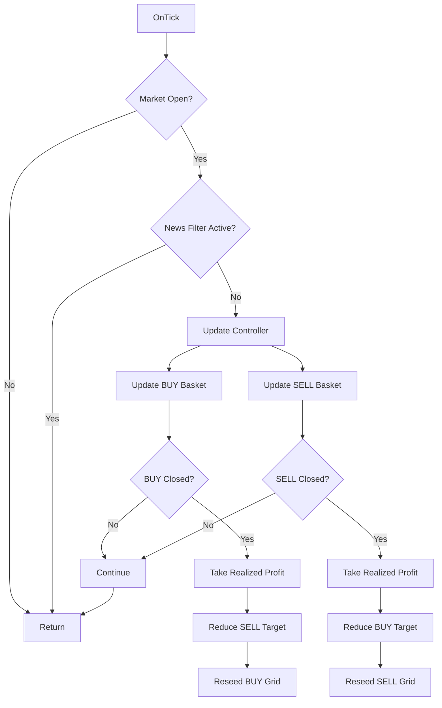
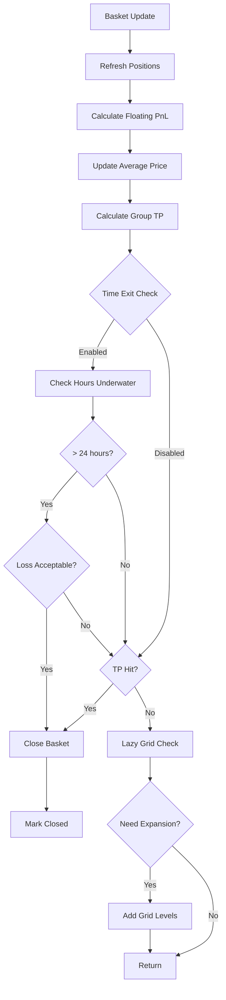
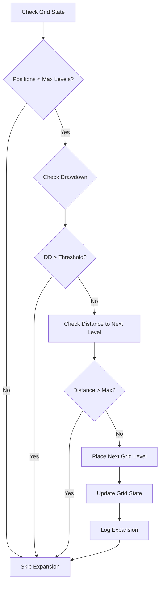
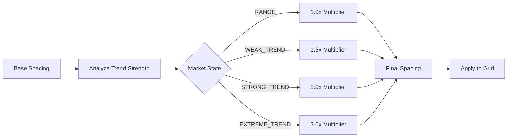
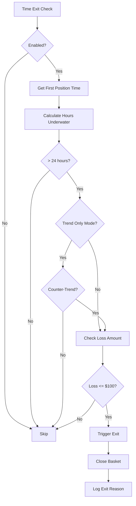
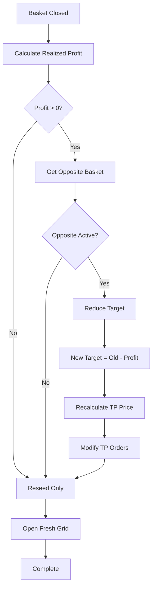
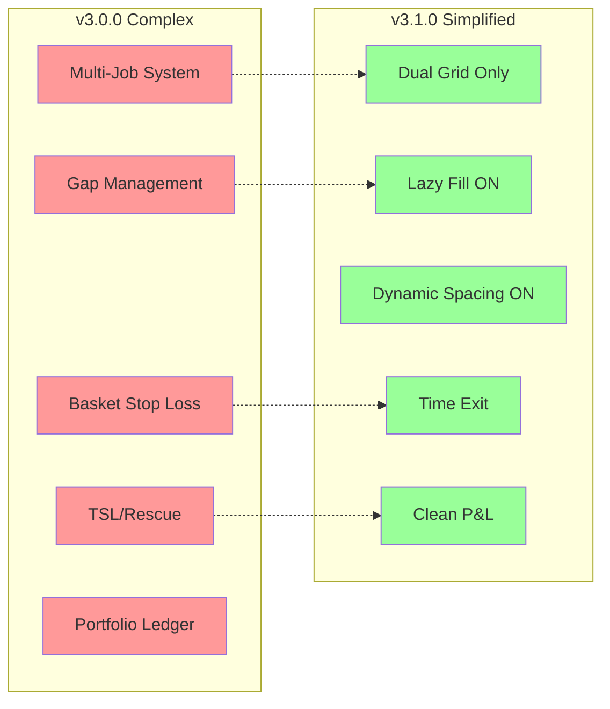
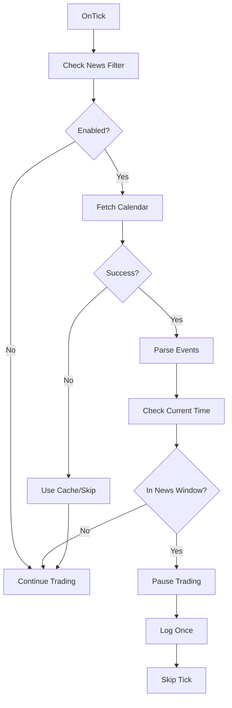
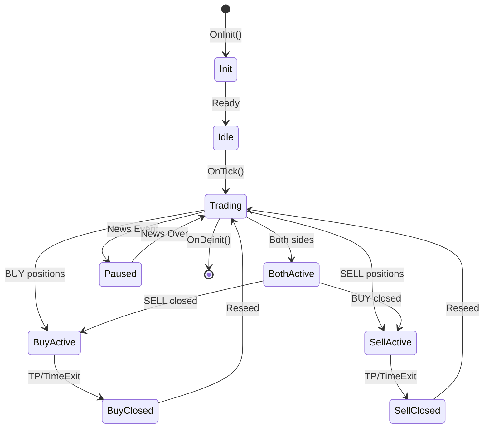

# Flowcharts - Recovery Grid Direction v3.1.0

## Main Control Flow

## Basket Update Flow

## Lazy Grid Fill (Always ON)

## Dynamic Spacing (Always ON)

## Time-Based Exit Logic

## Profit Redistribution

## Simplified vs Complex Architecture

## News Filter Integration

## Complete System State

---

*Last Updated: October 2024*